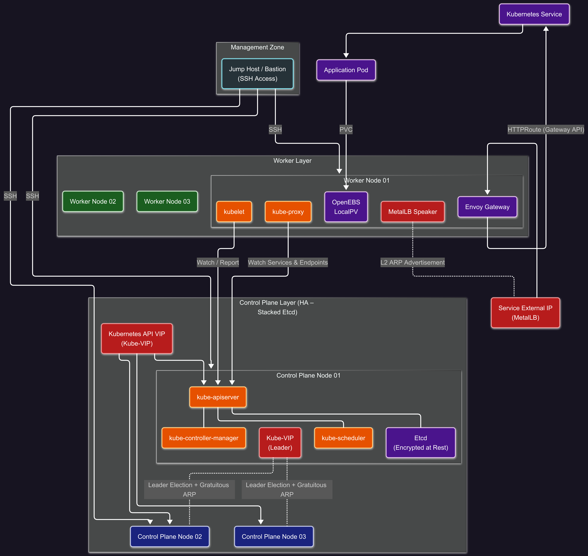

# Production-Grade Bare Metal Kubernetes Cluster

A complete, documentation-driven guide and manifest collection for deploying a **highly available Kubernetes cluster on bare metal or self-managed VMs**, following **real-world production patterns**.

This repository focuses on **architecture correctness, operational clarity, and platform engineering fundamentals** rather than cloud-managed abstractions.

---

## 🏗 Architecture Overview

This cluster uses a **stacked etcd topology** with **three control plane nodes** to achieve high availability and fault tolerance.

### Key Architecture Characteristics

- **Control Plane HA**
  - Three control plane nodes
  - Stacked etcd quorum
  - Single stable API endpoint via Virtual IP

- **API High Availability**
  - **Kube-VIP** runs as a static pod on all control plane nodes
  - Provides a floating **Kubernetes API VIP** using ARP-based leader election

- **Workload Isolation**
  - Control plane nodes do **not** run workloads
  - Worker nodes scale horizontally

- **Storage**
  - **OpenEBS LocalPV (Hostpath)** for dynamic PersistentVolume provisioning
  - Optimized for bare-metal and VM-based environments

- **Networking & Traffic Management**
  **Layer 4:** 
    -  **Kube-VIP**: Kubernetes API Virtual IP
    - **MetalLB (L2)**: Service `LoadBalancer` IPs
  - **Layer 7:** Envoy Gateway using Kubernetes Gateway API for HTTP routing

---

## 🧩 Traffic Flow Summary

1. Clients access services via a **MetalLB-assigned external IP**
2. Traffic is routed at **L7** by **Envoy Gateway**
3. Services forward traffic to backend Pods
4. Control plane access is handled independently via **Kube-VIP**

This separation ensures clean layering between **API availability**, **service exposure**, and **application routing**.

---

## 🛠 Technology Stack

| Layer | Technology |
|---|---|
| Cluster Bootstrap | `kubeadm` |
| Container Runtime | `containerd` |
| Networking (CNI) | Calico |
| Storage (CSI) | OpenEBS LocalPV |
| API HA | Kube-VIP (ARP mode) |
| Service LoadBalancer | MetalLB (L2 mode) |
| L7 Gateway | Envoy Gateway (Gateway API) |

---

## 🧮 Node Count & Resource Constraints

This repository is designed to be **architecture-first**, not resource-heavy.

- **Local / lab environments** may run:
  - 1 control plane (for learning)
  - 2 worker nodes
- **Production reference architecture** assumes:
  - 3 control plane nodes
  - Horizontally scalable worker nodes

> The architecture does **not change** with worker count.  
> Additional workers can be added without modifying control plane, networking, or storage design.

---

> Start with: **[01 – Prerequisites](manual-setup/docs/01-prerequisites.md)**
