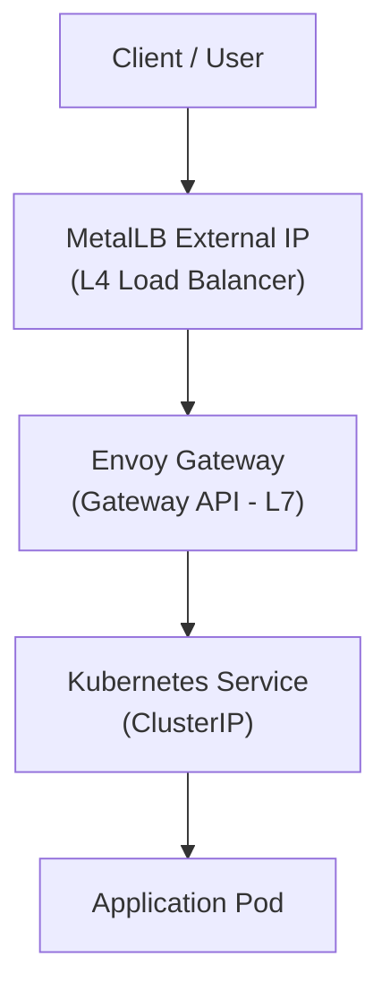

# 09 – Application Routing (Envoy Gateway – Layer 7)

**Goal:**  
Route external HTTP traffic from a **single LoadBalancer IP** to multiple applications inside the cluster using **domain-based and path-based routing**.

This layer builds on **MetalLB (L4)** and introduces **Gateway API + Envoy** for modern, standards-based ingress.

---
## Why Envoy Gateway?

Traditional Ingress controllers (e.g., NGINX Ingress):

- Use vendor-specific CRDs
    
- Are increasingly legacy
    
- Do not align cleanly with upstream Kubernetes APIs
    

**Envoy Gateway** implements the **Kubernetes Gateway API**, which is:

- Vendor-neutral
    
- Explicit and extensible
    
- The long-term replacement for Ingress
    

---

## Architecture Overview

```
Client
  |
  |  HTTP (Host: hello.test)
  v
[ MetalLB IP ]
  |
[ Envoy Gateway ]
  |
[ HTTPRoute ]
  |
[ Kubernetes Service ]
  |
[ Pod ]
```

- **MetalLB** provides the external IP
    
- **Envoy Gateway** terminates and routes traffic
    
- **HTTPRoute** defines routing rules

	
---

## Traffic Flow Overview

The following diagram shows how traffic enters the cluster and is routed from Layer 4 to Layer 7.


---

## Part 1: Install Gateway API CRDs

**Target:** Run on the **Jump Host**

Gateway API resources must exist **before** installing Envoy Gateway.

```bash
kubectl apply -f \
https://github.com/kubernetes-sigs/gateway-api/releases/download/v1.2.0/standard-install.yaml
```

Verify:

```bash
kubectl get crd | grep gateway.networking.k8s.io
```

---

## Part 2: Install Envoy Gateway Controller

**Target:** Run on the **Jump Host**

### Add Helm Repository

```bash
helm repo add envoy-gateway https://gateway.envoyproxy.io/charts
helm repo update
```

### Install Envoy Gateway

```bash
helm install eg oci://docker.io/envoyproxy/gateway-helm \
  --version v1.6.1 \
  -n envoy-gateway-system \
  --create-namespace \
  --skip-crds
```

Verify:

```bash
kubectl get pods -n envoy-gateway-system
```

All pods should be `Running`.

---

## Part 3: Create GatewayClass

**Purpose:**  
Bind the abstract **Gateway API** to the concrete **Envoy Gateway implementation**.

---

### Manifest

**File:** `gateway-class.yaml`

```yaml
apiVersion: gateway.networking.k8s.io/v1
kind: GatewayClass
metadata:
  name: eg
spec:
  controllerName: gateway.envoyproxy.io/gatewayclass-controller
```

Apply:

```bash
kubectl apply -f gateway-class.yaml
```

Verify:

```bash
kubectl get gatewayclass
```

Expected:

```
eg   gateway.envoyproxy.io/gatewayclass-controller
```

---

## Part 4: Create the Gateway (Cluster Front Door)

This resource creates the **actual LoadBalancer Service** backed by Envoy.

---

### Manifest

**File:** `gateway.yaml`

```yaml
apiVersion: gateway.networking.k8s.io/v1
kind: Gateway
metadata:
  name: production-gateway
  namespace: default
spec:
  gatewayClassName: eg
  listeners:
    - name: http
      protocol: HTTP
      port: 80
```

Apply:

```bash
kubectl apply -f gateway.yaml
```

---

### Verify IP Assignment

```bash
kubectl get gateway -n default
```

Expected:

- `PROGRAMMED: True`
    
- `ADDRESS`: IP from MetalLB pool (e.g. `10.47.160.200`)
    

This IP is now your **single external entry point**.

---

## Part 5: Deploy a Test Application

**Target:** Run on the **Jump Host**

```bash
kubectl create deployment hello-world \
  --image=nginxdemos/hello-plain-text \
  --replicas=1

kubectl expose deployment hello-world \
  --port=80 \
  --target-port=80
```

---

## Part 6: Create HTTPRoute (Domain-Based Routing)

**Purpose:**  
Route traffic for `hello.test` to the `hello-world` service.

---

### Manifest

**File:** `http-route.yaml`

```yaml
apiVersion: gateway.networking.k8s.io/v1
kind: HTTPRoute
metadata:
  name: hello-route
  namespace: default
spec:
  parentRefs:
    - name: production-gateway
  hostnames:
    - "hello.test"
  rules:
    - matches:
        - path:
            type: PathPrefix
            value: /
      backendRefs:
        - name: hello-world
          port: 80
```

Apply:

```bash
kubectl apply -f http-route.yaml
```

---

## Part 7: End-to-End Test

Replace `<GATEWAY_IP>` with the IP from Part 4.

```bash
curl -v -H "Host: hello.test" http://<GATEWAY_IP>
```

Expected:

- `HTTP/1.1 200 OK`
    
- Response shows backend pod details
    

---

## Debugging Tips

```bash
# Check Gateway status
kubectl describe gateway production-gateway

# Check route attachment
kubectl describe httproute hello-route

# Check Envoy service
kubectl get svc -n envoy-gateway-system
```

---

## Production Notes

- TLS termination can be added via HTTPS listeners
    
- Multiple domains map cleanly to one Gateway
    
- Envoy Gateway supports:
    
    - Rate limiting
        
    - JWT auth
        
    - mTLS
        
    - Traffic splitting
        

---